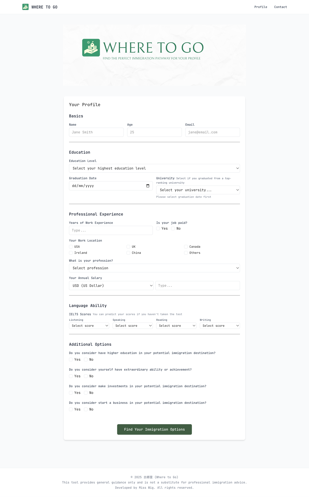

# WHERE TO GO - Immigration Assistant



A comprehensive web application that helps individuals find the perfect immigration pathway based on their personal profile, education, work experience, and preferences.

## 🌟 Features

### Comprehensive Profile Assessment
- **Personal Information**: Basic demographics and contact details
- **Education Background**: Qualification levels, graduation dates, and university rankings
- **Professional Experience**: Work history, salary, job categories, and locations
- **Language Proficiency**: IELTS scores with automatic CLB and CEFR calculations
- **Additional Options**: Investment capacity, entrepreneurship plans, and extraordinary abilities

### Intelligent Matching System
- **Multi-Country Support**: Canada, USA, United Kingdom, and Ireland
- **Programme Categories**:
  - Skilled Worker programmes
  - Investment and Entrepreneur visas
  - Graduate and Student pathways
  - Extraordinary Ability categories
  - High Professional routes

### Advanced Eligibility Calculation
- **Points-Based Systems**: Automatic calculation for Canadian Express Entry programmes
- **Requirements Validation**: Comprehensive checking against official programme criteria
- **Currency Conversion**: Multi-currency support for salary and investment requirements
- **Language Standards**: CLB and CEFR level calculations from IELTS scores


## 🛠️ Technology Stack

- **Frontend**: React 18 with JSX
- **Styling**: Tailwind CSS with custom design system
- **Build Tool**: Vite
- **Font**: JetBrains Mono for consistent typography
- **Deployment**: [Your deployment platform]

## 📋 Supported Immigration Programmes

### Canada
- Express Entry - Federal Skilled Worker Programme (FSWP)
- Express Entry - Canadian Experience Class (CEC)  
- Express Entry - Federal Skilled Trades Programme (FSTP)
- Start-up Visa Programme (SUV)
- Self-Employed Persons Programme
- Post-Graduation Work Permit (PGWP)

### United States
- EB-1A: Extraordinary Ability
- EB-1B: Outstanding Professors and Researchers
- EB-1C: Multinational Managers or Executives
- EB-2A: Advanced Degree Professionals
- EB-2B: Exceptional Ability
- EB-2 NIW: National Interest Waiver
- EB-3: Skilled Workers and Professionals
- EB-5: Immigrant Investor Programme
- H-1B Visa
- L-1A/L-1B: Intracompany Transferees

### United Kingdom
- Skilled Worker Visa
- Global Talent Visa
- Innovator Founder Visa
- High Potential Individual Visa
- Graduate Visa

### Ireland
- Critical Skills Employment Permit (CSEP)
- General Employment Permit
- Investor Programme (IIP)
- Start-up Entrepreneur Programme (STEP)
- Stamp 1G (Graduate)

## 🏗️ Project Structure

```
src/
├── components/
│   ├── ProfileForm.jsx          # Main form component
│   └── ResultsList.jsx          # Results display component
├── data/
│   ├── immigrationRequirements.js    # Shared requirements and standards
│   └── popularImmigrationCountries/
│       ├── canada.js            # Canadian programmes
│       ├── america.js           # US programmes
│       ├── unitedKingdom.js     # UK programmes
│       └── ireland.js           # Irish programmes
├── utils/
│   └── eligibilityCalculator.js # Core matching algorithm
├── App.jsx                      # Main application component
├── main.jsx                     # Application entry point
└── index.css                    # Global styles
```

## 🚀 Getting Started

### Prerequisites
- Node.js 18+ 
- npm or yarn

### Installation

1. Clone the repository:
```bash
git clone https://github.com/yourusername/immigration_assistant.git
cd immigration_assistant
```

2. Install dependencies:
```bash
npm install
```

3. Start the development server:
```bash
npm run dev
```

4. Open your browser and visit `http://localhost:5173`

### Building for Production

```bash
npm run build
```

## 🎯 How It Works

1. **Profile Creation**: Users complete a comprehensive form covering all aspects relevant to immigration
2. **Intelligent Analysis**: The system processes the profile against hundreds of programme requirements
3. **Real-time Calculation**: Points are calculated for points-based systems, and eligibility is determined
4. **Personalised Results**: Users receive a filtered list of programmes they qualify for, sorted by country and scoring
5. **Detailed Information**: Each result includes programme details, official links, and specific notes

## 🔧 Key Features

### Language Assessment
- Automatic CLB (Canadian Language Benchmarks) calculation from IELTS scores
- CEFR (Common European Framework) level determination
- Individual skill assessment for programmes with specific requirements

### Education Evaluation
- Comprehensive education level mapping
- Top-ranking university recognition for UK High Potential Individual visa
- Graduation date validation for time-sensitive programmes

### Financial Requirements
- Multi-currency salary and investment amount handling
- Real-time currency conversion
- Investment threshold validation

### Points Calculation
- Federal Skilled Worker Programme scoring
- Self-Employed Persons Programme assessment
- Age, education, experience, and language factor integration

## 📊 Technical Highlights

- **Modular Architecture**: Separate country-specific programme definitions
- **Extensible Design**: Easy to add new countries and programmes
- **Robust Validation**: Comprehensive form validation with real-time feedback
- **Responsive Design**: Mobile-friendly interface with consistent UX
- **Performance Optimised**: Efficient calculation algorithms and component structure


## 📝 Licence

This project is proprietary software. All rights reserved. See the [LICENSE](LICENSE) file for details.

**Commercial Use**: Modification, distribution, or commercial use requires explicit written permission. Contact Miss Wig for licensing enquiries.

## ⚠️ Disclaimer

This tool provides general guidance only and is not a substitute for professional immigration advice. Immigration laws and requirements change frequently. Always consult with qualified immigration professionals and refer to official government sources for the most current and accurate information.

## 👩‍💻 Developer

Developed by Miss Wig. All rights reserved.

---

**去哪里 (Where to Go)** - Find your perfect immigration pathway with confidence.